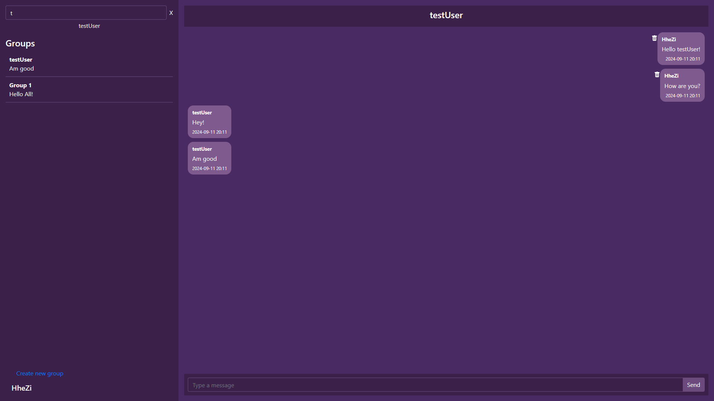
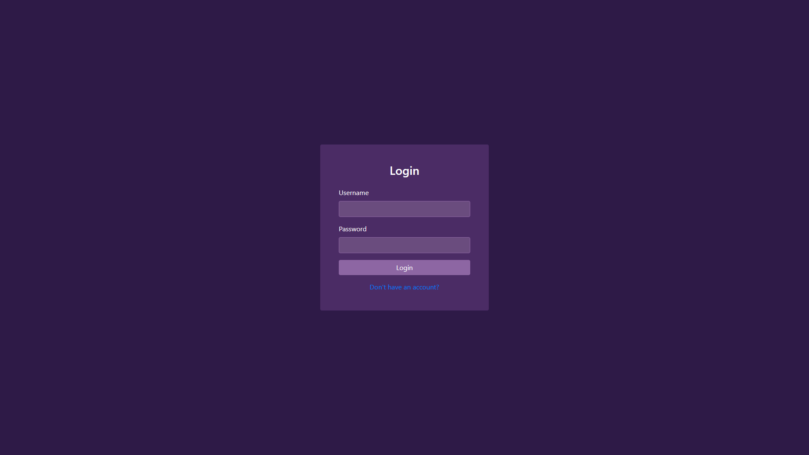
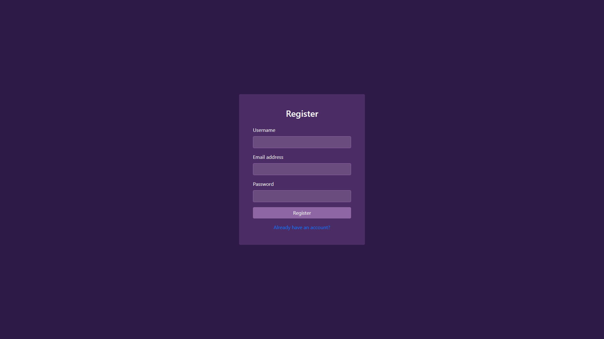
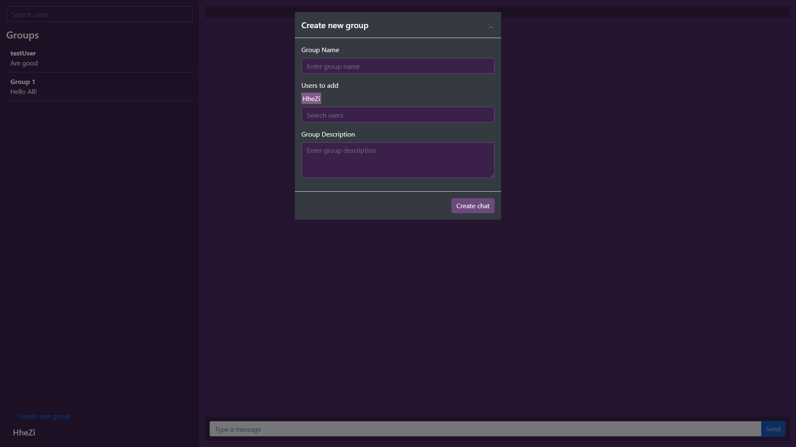
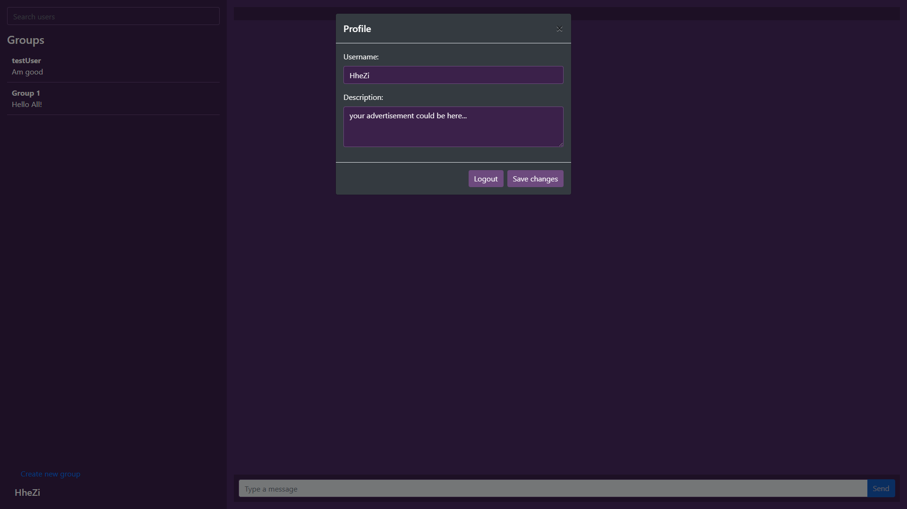

# Spring Boot Chat Application

## This is a small chat application written on Java, Spring, [WebSockets(Using STOMP Messaging Protocol)](https://docs.spring.io/spring-framework/reference/web/websocket.html) and SockJs for Front-End.

## Home Page 



## Login Page 



## Registration Page 

 

## Create new group window 



## User profile window 



### Installation

1. Clone the repository to your local machine:

```bash
git clone https://github.com/HheZi/SpringBootChatApplication
```

2. Navigate to the project directory:

```bash
cd Bookstore
```

3. Compile the source code:

```bash
javac -d bin src/*.java
```

## Contributing

Contributions are welcome! If you have suggestions for improvements or new features, feel free to submit a pull request or open an issue.

1. Fork the repository.
2. Create your feature branch (git checkout -b feature/AmazingFeature).
3. Commit your changes (git commit -m 'Add some AmazingFeature').
4. Push to the branch (git push origin feature/AmazingFeature).
5. Open a pull request.